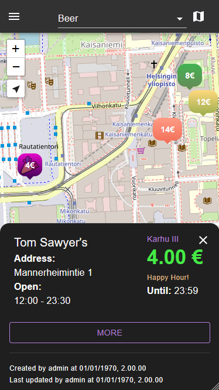
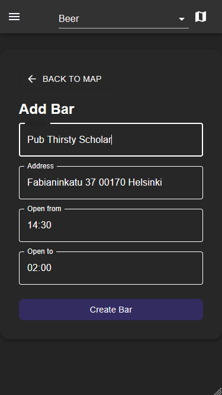
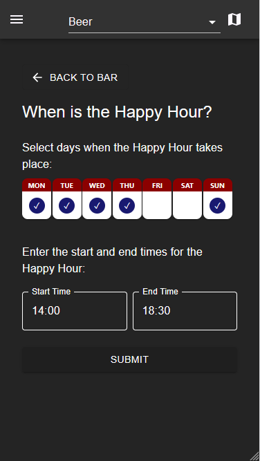
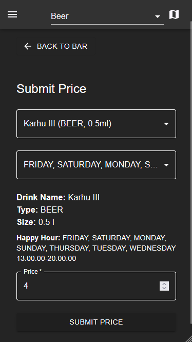
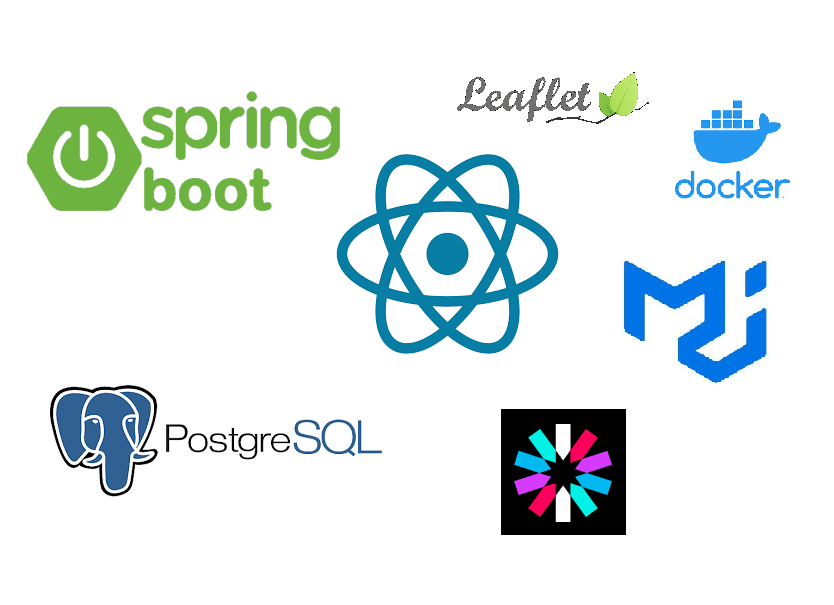

# Happy Pour - Local Cafe and Bar Prices

### We are Live! Feel free to try Happy Pour!

An alpha build can be found here -> https://happypour.duckdns.org/

---
### What is Happy Pour?
Happy Pour is an application that allows users to explore and compare happy hours offers and prices of drinks (beers, wine and coffee for the moment) at local cafes and bars in their area. The prices are maintained and updated by the local users so the information on the web app is as accurate as the active users.
  

 

### Using the App
Users can submit local establishments, prices and offers using an intuitive interface:

---

### Technologies used

Happy Pour is built using modern technologies including:
- React
- TypeScript
- Spring Boot
- PostgreSQL
- Material UI components
- Leaflet OpenStreetMap
- JWT authentication
- Docker
